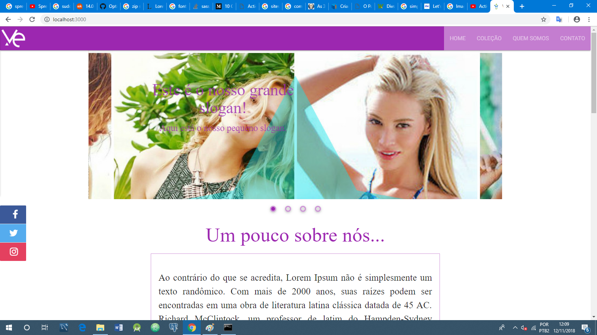

# README

Projetinho criado para a empresa Via Elegance, empresa de roupas intimas

Projeto consiste em um webapp para a empresa onde trabalho, projeto ainda em execução.

Para consegui subir o projetinho e ver funcionando...

Você tem que ter o Ruby '2.5.3', Rails '~> 5.2.1' e por ultimo ter postgreSql instalado e configurar ele.

depois só dar um bundle install e navegar no pequeno site.

A tecnologia de design: framework materialize.
